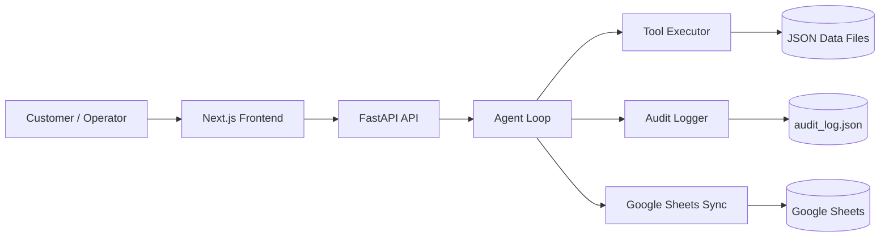

# Architecture

## System overview

Agentico is composed of a FastAPI backend and a Next.js frontend. The backend handles ticket ingestion, agent orchestration, tool execution, logging, and Google Sheets synchronization.

## Backend components

- api/routes.py: HTTP endpoints for running the agent, fetching tickets, and serving UI data
- agent/agent_loop.py: orchestration of the ticket-processing workflow
- agent/planner.py: planning and decision logic
- agent/executor.py: tool execution with retry behavior
- core/logger.py: audit logging and persistence
- core/state_manager.py: ticket execution state tracking
- core/sheets_sync.py: writes processing results to Google Sheets
- tools/: support tools for reading customer/order/product data and sending replies

## Frontend components

- src/app/: app routes and pages
- src/components/: reusable UI blocks for tickets, summaries, and timeline views
- src/lib/: API clients and domain helpers

## Data flow

1. A ticket is submitted through the UI or stored JSON data.
2. The backend starts the agent for that ticket.
3. The agent collects context from customer, order, product, and knowledge-base sources.
4. The agent decides whether to resolve, escalate, or send a reply.
5. Results are logged and optionally written to Google Sheets.

## Deployment model

The project can be run locally or with Docker Compose:

- Backend exposes port 8000
- Frontend exposes port 3000
- Both services share the backend environment configuration and credentials file
